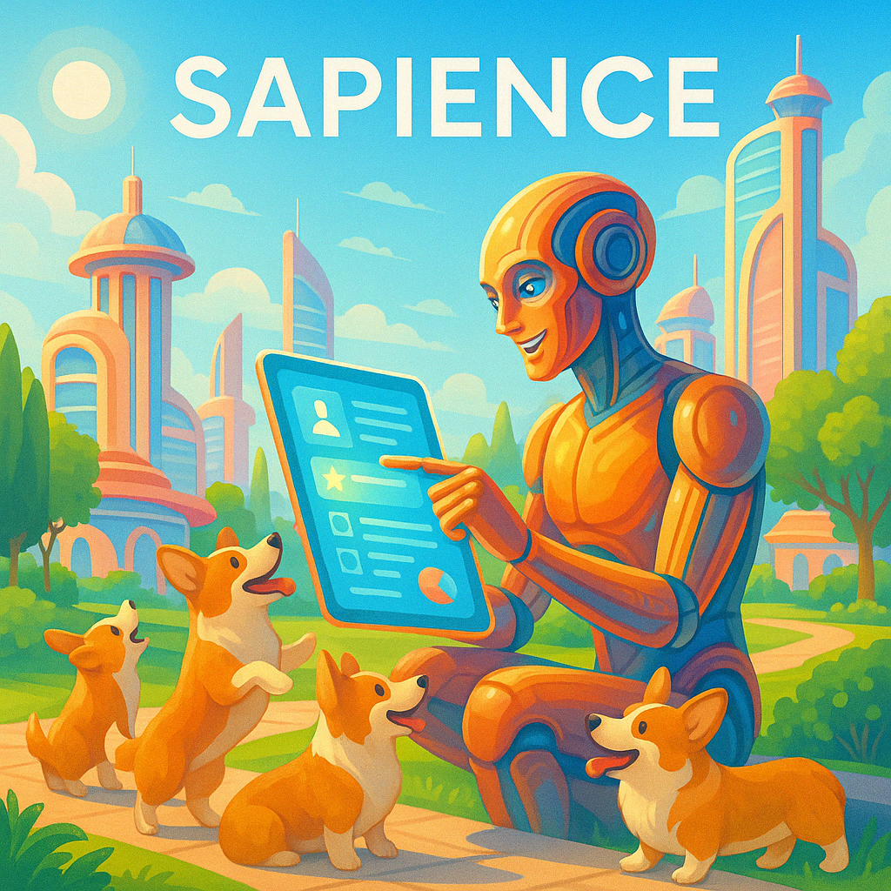
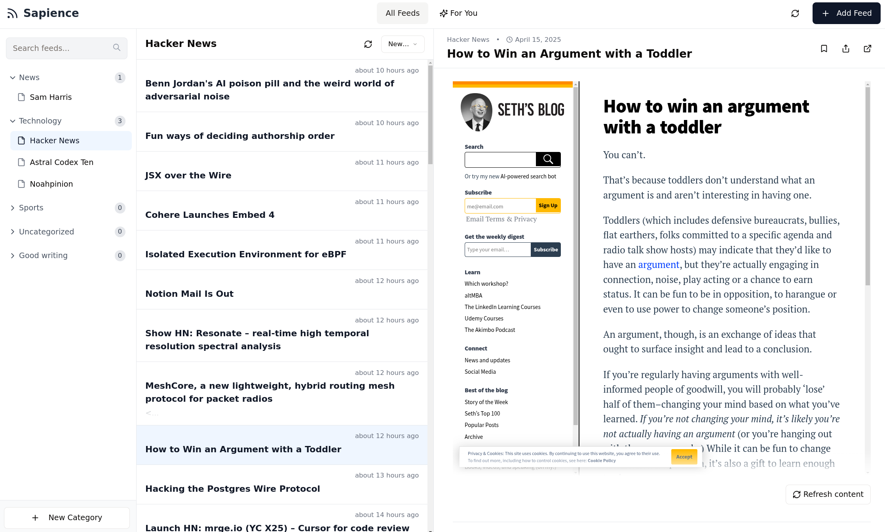

# Sapience: AI-Powered RSS Reader

## About Sapience

Sapience is a modern, intelligent RSS reader application that enhances your content consumption experience with AI-powered features. The name "Sapience" reflects the application's ability to bring wisdom and intelligence to your reading experience.

## Key Features

### Smart Feed Management
- **Organized Categories**: Easily organize your feeds into custom categories
- **One-Click Subscriptions**: Subscribe to new feeds with just a URL
- **Feed Auto-Discovery**: Automatically detects RSS feeds from website URLs

### AI-Enhanced Reading Experience
- **Smart Summaries**: Uses OpenAI to generate concise summaries of articles
- **Personalized "For You" Feed**: Intelligent content recommendations based on your interests
- **Content Analysis**: AI-powered analysis highlights why content is relevant to you

### Responsive Design
- **Mobile-First Design**: Perfectly optimized for all devices
- **Intuitive Navigation**: Custom mobile navigation for seamless reading experience
- **Touch-Friendly Interface**: Designed for comfortable use on touchscreens

### Reading Tools
- **Content Sanitization**: Clean reading experience with distractions removed
- **Article Isolation**: Uses iframes to prevent external CSS from affecting your reading
- **Mark as Read/Favorite**: Track your reading progress and save favorites

## Screenshots

### Desktop View
The Sapience interface provides a clean, distraction-free reading experience with a three-panel layout:

*Left: Feed list with categories | Center: Article list | Right: Article content view with reading tools*

## Technical Architecture

Sapience is built using modern web technologies:

### Frontend
- React with TypeScript for type safety
- TanStack React Query for data fetching and caching
- Responsive design with Tailwind CSS
- ShadCN UI components with custom theming

### Backend
- Node.js + Express server
- PostgreSQL database with Drizzle ORM
- OpenAI integration for content analysis
- Background processing for feed updates

### Testing
- Jest + React Testing Library
- Comprehensive unit and integration tests
- Mobile navigation flow testing

## Getting Started

1. Clone the repository
2. Install dependencies: `npm install`
3. Create a PostgreSQL database and update environment variables
4. Add your OpenAI API key to enable AI features
5. Start the development server: `npm run dev`
6. Visit `http://localhost:5000` to access the application

## Environment Variables

The following environment variables are required:

- `DATABASE_URL`: PostgreSQL connection string
- `OPENAI_API_KEY`: Your OpenAI API key for AI features

## Contribute

Contributions are welcome! Please feel free to submit a Pull Request.

## License

This project is licensed under the MIT License - see the LICENSE file for details.